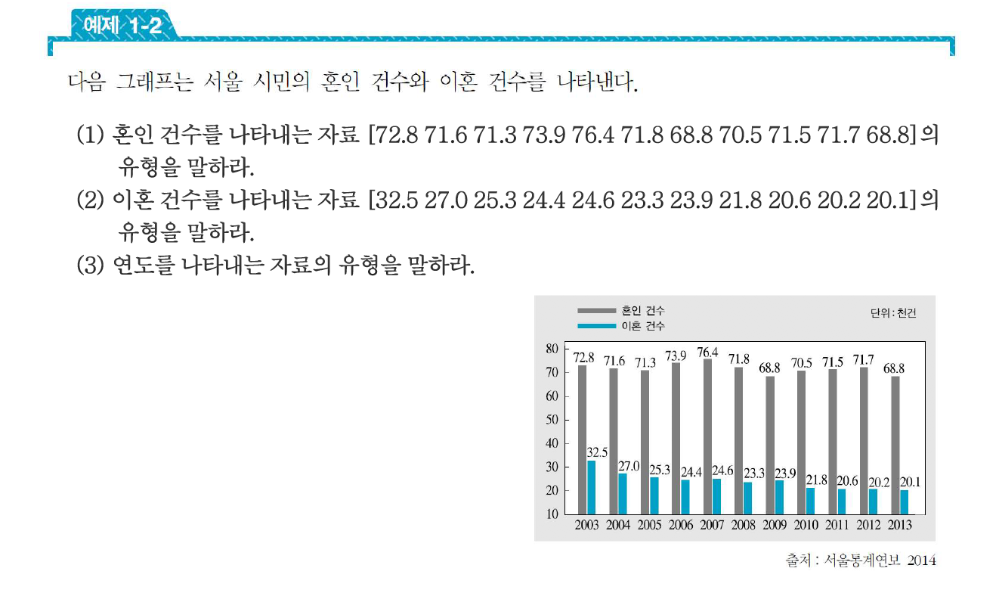
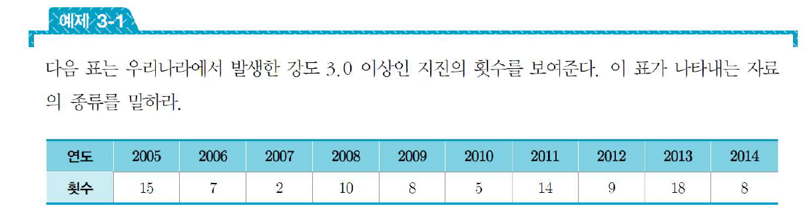
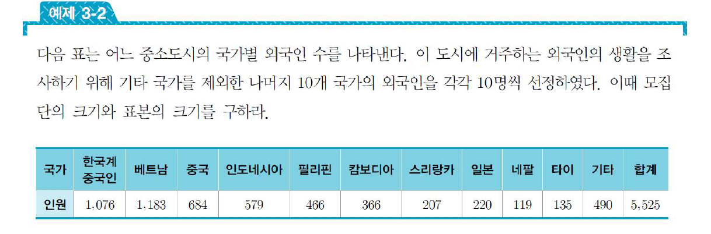
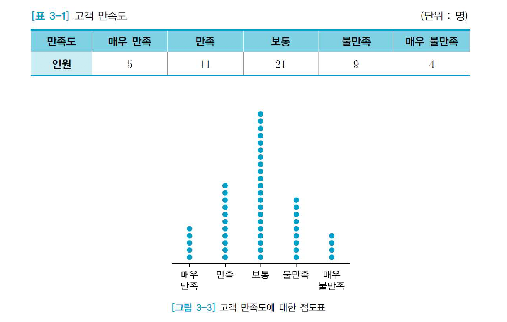
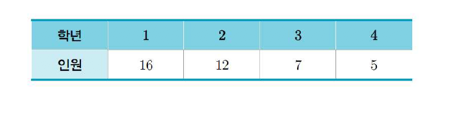
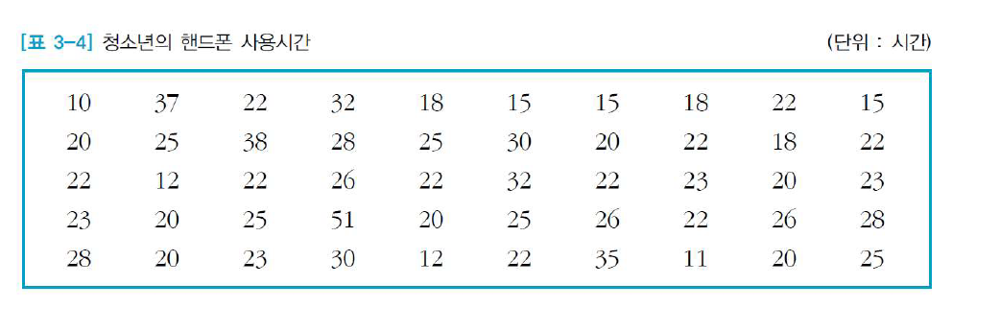
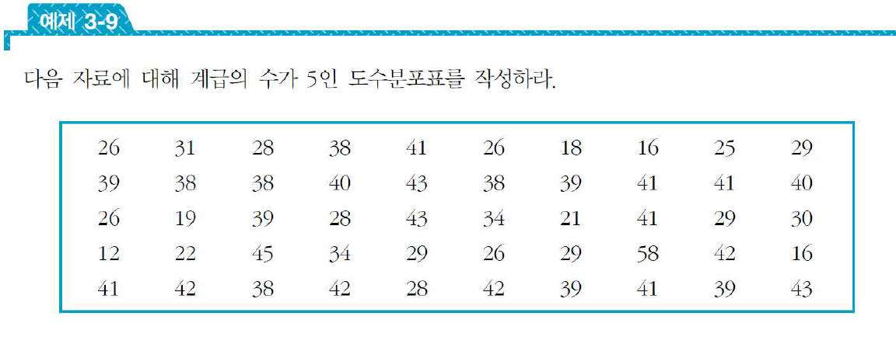

# 데이터와 통계

- 모집단과 표본
    경부 고속도로에 있는 전체 35개 휴게소의 대표 음식가격을 알기 위해
    7개의 휴게소를 선정하여 조사하였다. 그 결과 대표 음식의 평균 가격이 7,000원 이었다. 이 때 모집단과 표본의 크기는?

- 모집단은 모든 휴게소가 대상이므로 모집단의 크기는 35
- 전체 휴게소 중 7개를 선정하였으므로 표본의 크기는 7

* 기술 통계학과 추측 통계학
    - 기술 통계학
        - 자료를 수집하거나 정리하여, 표 또는 그래프나 그림으로 나타냄
        - 자료가 갖는 수치적인 특성을 분석하고 설명하는 방법을 다루는 통계학의 한 분야
    
    - 추측 통계학
        - 표본을 대상으로 얻은 정보로부터 모집단에 대한 불확실한 특성을
        - 과학적으로 추론하는 방법을 다루는 통계학의 한 분야

* 자료의 종류
- 모든 통계 자료는 수치적인 척도로 표현되거나, 그렇지 않은 유형으로 분류된다.
    수치적인 척도로 표현된다는 것은 자료가 숫자에 의하여 표현되며, 그 숫자 자체가 크다거나 작다 또는 많다거나 적다 등과 같이 의미를 가지는 경우를 말함

- 양적 자료
    - 숫자로 표현되며, 그 숫자가 의미를 갖는 자료

- 질적자료 혹은 범주형 자료
    - 숫자에 의하여 표현되지 않고 여러개의 범주로 구분되는 자료

* 질적 자료의 예
    - 혈액형, 지역명, 피부색, 종교, 정당, 지역별 우편번호

* 양적 자료의 예
    - 이산 자료
        - 하루 통화 건수, 통계 교재의 쪽수, 수능 접수자 수 (셈할 수 있는 자료)
    - 연속 자료
        - 키, 높이, 길이, 온도, 몸무게, 강수량 (구간에서 측정되는 자료)

* 명목 자료 : 각 범주를 숫자로 대치한 자료
    - A형 - 1 , B형 - 2, AB형 - 3, O형 - 4

* 순서 자료 : 순서의 개념을 갖는 자료
    - 초등학교 - 1, 중학교 - 2, 고등학교 - 3, 대학 이상 - 4

* 집단화 자료 : 양적자료를 구간별로 구분하여 범주형 자료로 변환한 자료
    - 90 점 이상 A, 80 ~ 89 점 B, 70 ~ 79 점 C

예:

1. 양적 자료, 이산 자료 (셈 할 수 있으며, 이산적인 자료)
2. 위와 마찬가지
3. 연도는 질적 자료에 해당 됨(숫자에 의해 표현은 되지만, 의미를 갖진 않고, 일종의 그룹의 개념이기 떄문에 질적 자료)

* 자료 : 어떤 통계적인 목적에 맞춰서 수집된 대상
* 통계 : 자료를 수집하여 분석하거나, 이를 표 또는 그림으로 표현하여 수집한 자료로 부터 의미있는 정보를 얻어내는 과정

* 예:
    - 하루 동안 수신 된 스팸 문자의 횟수와 같이 셈을 할 수 있는 자료를 이산 자료
    - 몸무게, 키와 같이 어떤 구간 안에서 측정되며, 셈할 수 없는 자료를 연속 자료

양적 자료이며, 이산 자료

* 명목 자료 : 각 범주를 숫자로 나타낸 자료
    - 고객 만족도 조사에서 5점 척도 (1,2,3,4,5는 범주를 나타낸 것, 숫자는 의미 없다)

* 순서 자료 : 순서의 개념을 갖는 질적 자료
    - 초등학교부터 대학교까지 네 가지 범주에 숫자를 부여 할 경우
    - 초등 - 1, 중 - 2 , 고 - 3, 대 - 4
    - 순서의 개념이 포함된다.

* 집단화 자료
    - 예를들어 성적을 점수 구간에 맞추어 A, B, C와 같이 따로 구별 할 경우

## 모집단과 표본

- 모집단 : 통계 목적에 부합하는 모든 자료들의 집단
- 표본 : 모집단의 일부인 자료들의 집단

    선거에서 유권자의 일부를 대상으로 지지도 조사를 할 경우
    투표권을 갖는 19세 이상의 국민 전체가 모집단
    이들 중 지지도 조사의 대상이 되는 유권자의 일부가 표본이 되는 것

- 모집단의 크기는 5,525이고 (전체 외국인) 이 중 각 국가별로 10명을 뽑은 총 100명이 표본의 크기가 된다.

## 질적 자료의 정리

- 점도표
    수집한 범주형 자료에 대해 수평축에 각 범주를 작성하고 수직방향으로 각 범주의 측정값에 해당하는 수 만큼 점으로 나타낸 그림을 점도표라 한다.

- 장점 : 시각적으로 쉽게 이해 할 수 있다.
- 단점 : 관찰 도수에 해당하는 개수만큼 점을 찍어야 하므로 관찰 도수가 많으면 불편하다.

점도표임

- 도수표
    각 범주의 도수와 상대도수 또는 범주의 백분율을 기입하여 보여주는 표를 도수표 라 함

- 장점 : 각 범주를 상대적으로 비교 할 수 있다.

- 도수(frequency) : 각 범주에 대해 관찰된 자료의 수
- 상대도수(relative frequency) : 각 범주의 도수를 전체 도수로 나눈 값
    - `상대도수 = 범주의 도수 / 전체 도수`
- 백분율(percentage) : 상대도수에 100을 곱한 값 (단위 %)

동아리 회원 수에 대한 도수표를 작성해라

- 동아리 전체 인원 수는 40명.
- 1 학년의 상대도수는 16/40 = 0.4 백분율 40%
- 2 학년의 상대도수는 12/40 = 0.3 백분율 30%
- 3 학년의 상대도수는 7/40 = 0.175 백분율 17.5%
- 4 학년의 상대도수는 5/40 = 0.125 백분율 12.5%

- 막대그래프
    - 각 범주의 도수에 해당하는 높이를 갖는 막대모양의 직사각형으로 나타낸 그림을 막대그래프라고 함

- 장점 : 도수표를 시각적으로 쉽게 이해 가능
- 범주의 도수 또는 백분율이 감소하도록 범주를 제 배열한 그림을 `파레토 그래프` 라고 함

- 꺾은선 그래프
    - 막대그래프의 각 직사각형 위쪽 중간을 선으로 이으면 꺾은선 그래프..

- 비율 그래프
    - 각 범주의 크기를 비율로 나타낸 그림을 비율그래프
    - 단순히 각 범주의 크기만을 비교할때 사용함

* 종류
    - 띠 그래프
    - 원 그래프 (상대도수 * 360' 만큼이 원 그래프에서의 영역)

- 점도표
    - 수평축에 각 범주를 기입하고, 수평축 위에 각 범주 또는 측정값의 관찰 횟수를 점으로 나타낸 그림
    - 양적 자료에도 사용 가능
- 장점 : 각 범주 사이의 관찰값을 쉽게 비교 가능
- 단점 : 관찰값의 수에 해당하는 점을 찍어서 나타내므로 그 수가 많은 경우 부적합

## 도수분포표

- 양적 자료를 적당한 간격으로 집단화 하여 계급, 도수, 상대도수, 누적도수, 누적상대도수, 계급값등을 기입한 표를 도수분포표라고 합니다.

- 도수분포표의 특징
    1. 전체 자료에 대한 대략적인 중심의 위치를 알 수 있다.
    2. 전체 자료의 흩어진 분포 모양을 대략적으로 알 수 있다.
    3. 극단적으로 관찰된 자료값(특이값)을 대략적으로 알 수 있다.
    4. 각 계급 안에 들어 있는 정확한 측정값을 알 수 없다.
    
* 계급 : 양적자료를 일정한 간격으로 나눈 구간
* 계급간격 : 각 계급의 너비
* 누적도수 : 이전 계급까지의 모든 도수를 합한 도수
* 누적상대도수 : 이전 계급까지의 모든 도수를 합한 도수
* 계급값 : 각 계급의 중앙값, 즉 다음에 의해 결정되는 수치
`계급값 = 각 계급의 양 끝값의 합 / 2`

* 작성 요령
    1. 계급의 수 k를 적당히 정한다.
    2. R = 최대 측정값 - 최소 측정값을 구한다
    3. 계급의 간격을 결정한다. 이 때 계급간격은 R을 계급의 수 k로 나눈 값보다 큰 가장 작은 정수로 택한다 (w = R/k)
    4. 제 1계급에서 왼쪽 끝값을 최소 측정값보다 0.5만큼 작은 수를 이용하여 간격이 w인 계급을 작성한다.
    5. 나머지 지표들을 작성

계급의 수가 5인 도수 분포표를 만들어보자

1. 계급의 수가 5인 도수분포표이므로 k=5
2. 최대 측정값은 51, 최소 측정값은 10이므로 R = 41
3. 41/5 = 8.2이므로 w = 9로 정한다.
4. 제 1계급의 왼쪽 끝 값은 10 - 0.5 = 9.5이다
    - 9.5 ~ 18.5가 첫번째 계급이다.

|계급 간격|도수|상대도수|누적도수|누적상대도수|계급값|
|------|---|------|-------|--------|-----|
|9.5~18.5|10|0.20|10|0.20|14|
|18.5~27.5|29|0.58|39|0.78|23|
|27.5~36.5|8|0.16|47|0.94|32|
|36.5~45.5|2|0.04|49|0.98|41|
|45.5~54.5|1|0.02|50|1.00|50|

도수 분포표 작성

1. 계급의 수 5
2. 최대 측정값은 58, 최소 측정값은 12, R = 58-12
    - 46/5 = 9.2 따라서 w = 10
3. 제 1계급의 왼쪽 끝 값은 12 - 0.5 따라서 11.5 ~ 21.5가 제 1계급의 범위

이하 생략

* 계급의 수 결정 방법.
    - 일반적으로 자료의 수가 200 미만이면 $$ k = \sqrt{n}\pm 3$$ 에 가까운 정수를 택하고, 200 이상이면 스터지스 공식이라고 부르는 $$ k = 1 + 3.3\log_10 n $$ 을 택한다