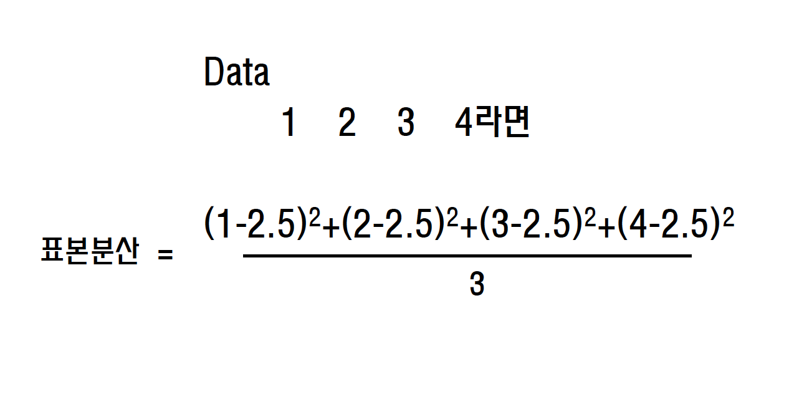

# 데이터 지표

* 평균값

데이터를 모두 더한 뒤 데이터의 개수로 나누어 구함


```python3
scores_df = pd.DataFrame({'score':scores},
                         index=pd.Index(['A', 'B', 'C', 'D', 'E',
                                         'F', 'G', 'H', 'I', 'J'],
                                        name='student'))

sum(scores) / len(scores) #평균값
```

* 편차
    - 각 데이터가 평균으로부터 떨어져 있는 정도
    - 각 학생의 성적 편차

```python3
mean = np.mean(scores)
deviation = scores - mean
```

* 분산
    - 산포도의 지표인 편차의 평균은 항상 0이다.
    - 편차의 제곱을 이용해 분산을 구한다.


* 분산
    - 표본 분산




* 표준 편차
    - 앞에 예에서 분산은 점수의 제곱이였다.
    - 분산에 제곱근을 취한것이 표준편차


- 나머지 산술평균, 편차, 분산애 관련된 내용은 추가 정리
